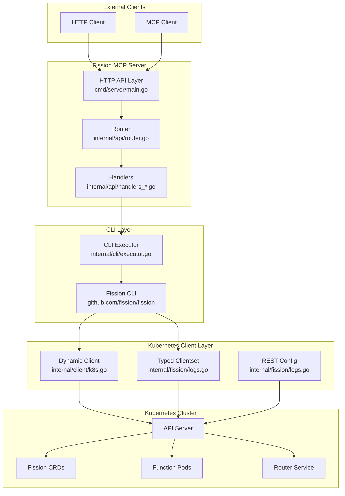
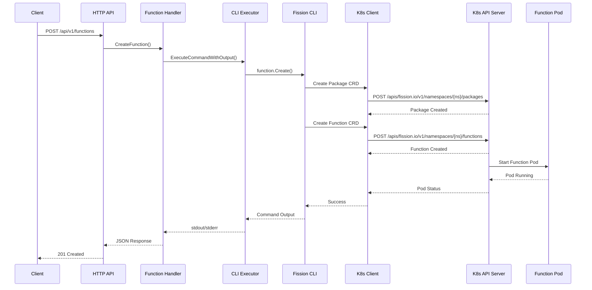
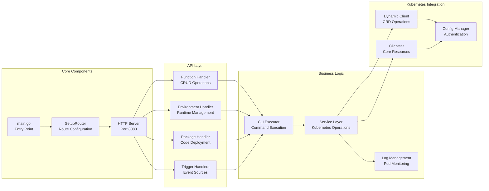
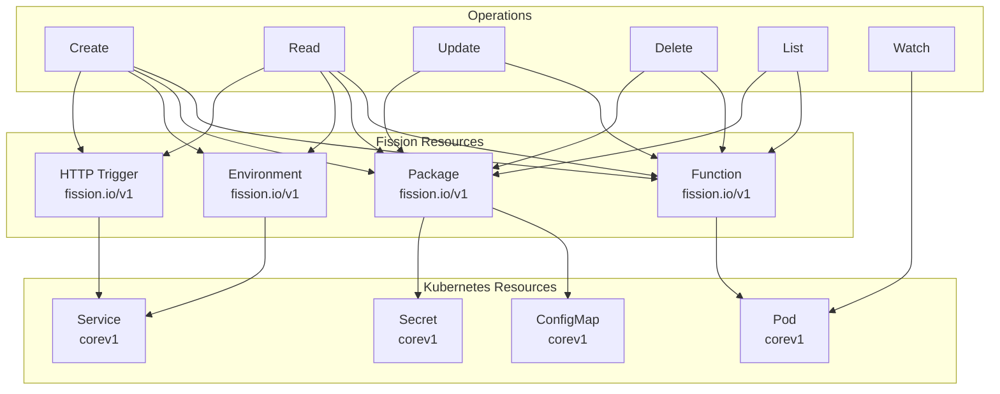
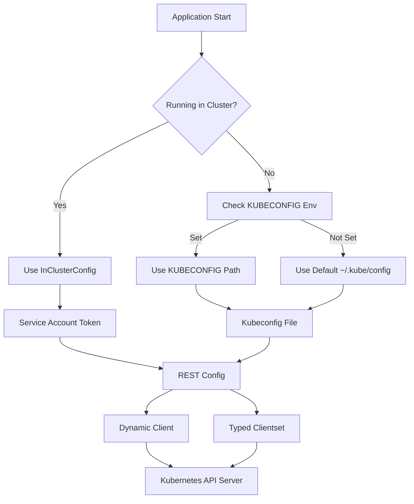

# Fission MCP Server - Kubernetes Interaction Diagrams

## 1. Architecture Overview



## 2. Request Flow Diagram



## 3. Component Relationship Diagram



## 4. Kubernetes Resource Interaction



## 5. Authentication Flow



## 6. Function Lifecycle

```mermaid
stateDiagram-v2
    [*] --> CreatePackage
    CreatePackage --> CreateFunction
    CreateFunction --> Pending
    Pending --> Building
    Building --> Ready
    Ready --> Executing
    Executing --> Idle
    Idle --> Executing
    Executing --> Error
    Error --> Building
    Ready --> Updating
    Updating --> Ready
    Executing --> Deleting
    Idle --> Deleting
    Deleting --> [*]